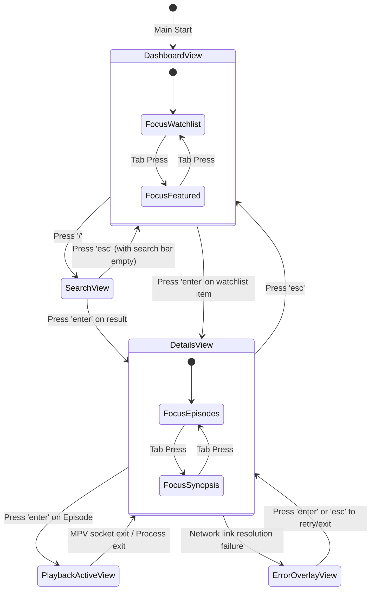

# TUI Navigation Map & UX Design
## Project: TerminalAnime CLI (`anime-cli`)

---

### 1. Navigation Flow Architecture

The client cycles through views by mutating the state variable inside the main Bubbletea model. Views adjust keyboard listening contexts and focus hierarchies dynamically.



---

### 2. Layout Wireframes & Styling Systems

The application interface utilizes a grid system with strict cell dimensions, built using Lipgloss.

#### 2.1. Dashboard Layout (Bento Grid Interface)
When the application starts, it displays a three-pane grid system:
*   **Header Panel:** Displays ASCII branding and the current status (e.g. Active Profile, Total Watchtime).
*   **Left Pane (Watchlist & History):** Displays currently watching shows, with a custom-drawn progress timeline bar.
*   **Right Pane (Seasonal / Featured):** Displays current anime releases, with dynamic tabs.

```
╭─────────────────────────────────────────────────────────────────────────────╮
│  ██████╗ ███╗   ██╗██╗███╗   ███╗███████╗      C L I   A N I M E            │
│  ██╔══██╗████╗  ██║██║████╗ ████║██╔════╝      [ Profile: Default ]         │
│  ╰──────────────────────────────────────────────────────────────────────────╯
│ ╭─ Watchlist & History (40%) ──────╮ ╭─ [ Seasonal ]  Trending  Popular (60%) ╮
│ │                                  │ │                                      │
│ │ > Chainsaw Man S2                │ │ 1. Frieren: Beyond Journey's End     │
│ │   [██████████████████░░░░] 80%    │ │    Studio: Madhouse | Rating: 9.1    │
│ │                                  │ │                                      │
│ │   Kaiju No. 8                    │ │ 2. Oshi No Ko Season 2               │
│ │   [██████░░░░░░░░░░░░░░░░] 30%    │ │    Studio: Doga Kobo | Rating: 8.7   │
│ │                                  │ │                                      │
│ │   Steins;Gate (Completed)        │ │ 3. Solo Leveling Season 2            │
│ │   [██████████████████████] 100%   │ │    Studio: A-1 Pictures | Rating: 8.5 │
│ ╰──────────────────────────────────╯ ╰──────────────────────────────────────╯
│ Help: / Search | tab Switch Focus | enter Select | q Quit                    │
╰─────────────────────────────────────────────────────────────────────────────╯
```

#### 2.2. Show Details Layout (Asymmetric Split Screen)
Provides structural space for cover images on the left, and detail listings on the right.

```
╭─────────────────────────────────────────────────────────────────────────────╮
│ [esc] Back to Dashboard                                                     │
├──────────────────────┬──────────────────────────────────────────────────────┤
│                      │ Frieren: Beyond Journey's End (TV)                   │
│                      │ Rating: 9.1 | Episodes: 28 | Status: Completed        │
│    [ Cover Art ]     │ Genres: Adventure, Fantasy, Drama                    │
│                      │                                                      │
│    Kitty, Sixel,     │ Synopsis: Mage Frieren and her companions defeated   │
│   iTerm2, or ANSI    │ the Demon King, bringing peace to the land. As the   │
│    Half-Block        │ years pass, Frieren must face the passage of time.   │
│                      │                                                      │
│    Width: 24 cells   ├──────────────────────────────────────────────────────┤
│    Height: 18 cells  │ Episodes                                             │
│                      │ > Ep 1: The Journey's End (24m)   [Resume at 12:45]  │
│                      │   Ep 2: It Didn't Have to Be Magic (23m)             │
│                      │   Ep 3: Ordinary Spells (24m)                        │
│                      │   Ep 4: The Land of Souls (24m)                      │
│                      │   Ep 5: Phantoms of the Past (24m)                   │
╰──────────────────────┴──────────────────────────────────────────────────────╯
```

#### 2.3. Search Overlay Layout
Appears on screen over existing layouts when the `/` character is pressed.

```
╭─────────────────────────────────────────────────────────────────────────────╮
│ Search: [ Attack on Titan________________________________________ ]        │
├─────────────────────────────────────────────────────────────────────────────┤
│ Results (4 matches found)                                                   │
│ > Attack on Titan: The Final Season (TV) [2020]                             │
│   Attack on Titan Season 3 Part 2 (TV) [2019]                               │
│   Attack on Titan Season 1 (TV) [2013]                                      │
│   Attack on Titan: The Movie (Movie) [2015]                                 │
╰─────────────────────────────────────────────────────────────────────────────╯
```

---

### 3. Keyboard Mappings & Action Dispatches

#### 3.1. Global Key Bindings
*   `q` or `ctrl+c`: Terminate the application immediately. Close external players, clean up temporary sockets, and flush progress files.
*   `/`: Trigger search input view. Toggles state focus to search input box.
*   `tab`: Cycle through panel focus zones (e.g. Watchlist -> Featured, or Episode List -> Synopsis).
*   `esc`: Navigate backwards to previous view stack or clear current search input.

#### 3.2. List View Controls (Vim-compatible)
*   `j` or `down-arrow`: Move the item selection cursor down by 1.
*   `k` or `up-arrow`: Move the item selection cursor up by 1.
*   `g`: Jump directly to the first item in the list.
*   `G`: Jump directly to the last item in the list.
*   `enter`: Activate selection. Triggers item details loading or spawns media player.

#### 3.3. Active Playback Overlay Controls
While external media players run, TUI input capture is suspended.
*   `esc` (pressed in terminal): Sends a terminate signal to the child process via the manager, closes IPC socket, and returns keyboard focus to Details view.
*   **Media Engine Controls (Native MPV Keybindings):**
    *   `space`: Play/Pause toggle.
    *   `left-arrow` / `right-arrow`: Skip backwards/forwards 5 seconds.
    *   `up-arrow` / `down-arrow`: Volume up/down.
    *   `f`: Toggle fullscreen.

---

### 4. Focus Management & Selection Styling

Focus states are visually communicated through dynamic border shifts and color highlights to guide user navigation.

#### 4.1. Panel Border Transitions
*   **Focused Panel Style:** Selected panels are rendered using double-line borders (`║`, `═`) and colored with the active genre's accent color (e.g. Forest Green for Fantasy, Crimson for Action).
*   **Unfocused Panel Style:** Inactive panels are rendered using thin single-line borders (`│`, `─`) and colored in dim Zinc Grey (`#3F3F46`).

#### 4.2. Selection Cursor Indicators
The selected list item is prefixed with a dynamic cursor arrow (`> `) rendered in Amber (`#F59E0B`), and its background is shaded using a subtle grey block highlight. Unselected items are padded with spaces to keep alignment.

#### 4.3. Text Input Focus Modes
When the Search box is active, its borders light up in Emerald Green (`#10B981`) and a block cursor (`█`) flashes inside the input field. When the Search box is inactive, its borders dim to Zinc Grey and the block cursor is disabled.

---

### 5. File Cross-References
*   High-level requirements and user stories: See [prd.md](file:///c:/Users/cheth/Desktop/TerminalAnime/prd.md).
*   Underlying system loops and socket connections: See [trd.md](file:///c:/Users/cheth/Desktop/TerminalAnime/trd.md).
*   Phased development plan: See [implementation_plan.md](file:///c:/Users/cheth/Desktop/TerminalAnime/implementation_plan.md).
*   Domain structs and JSON specifications: See [techstack.md](file:///c:/Users/cheth/Desktop/TerminalAnime/techstack.md).
*   CI/CD pipelines and deployment scripts: See [deployment_plan.md](file:///c:/Users/cheth/Desktop/TerminalAnime/deployment_plan.md).
