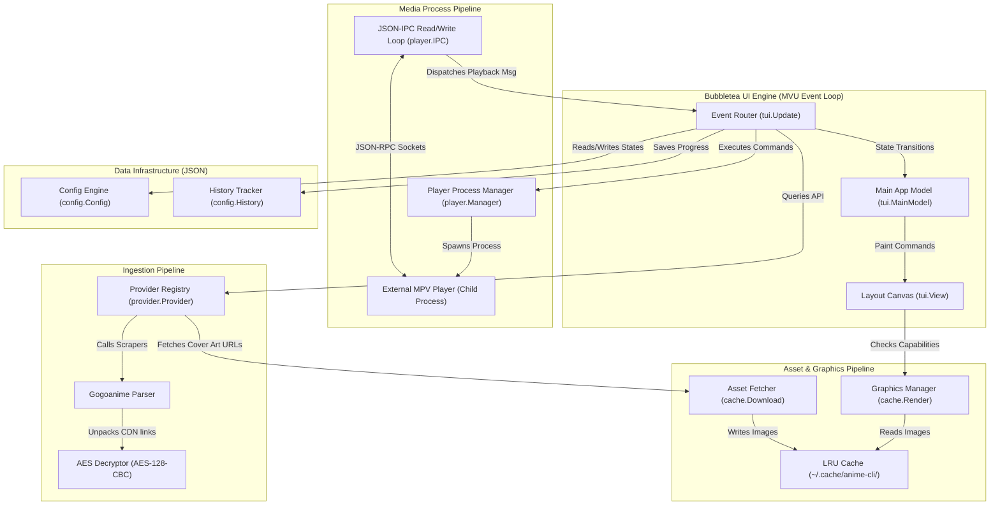

# Technical Requirements Document (TRD)
## Project: TerminalAnime CLI (`anime-cli`)

---

### 1. System Architecture & Component Topology

The application operates as a single, statically compiled Go binary running inside a terminal emulator. It utilizes Charm's `bubbletea` framework for state management, `lipgloss` for visual layout construction, and orchestrates several concurrent worker pools to manage network scraping, cover image caching, and media player IPC sockets.



---

### 2. Bubbletea MVU State Machine

The interface follows the Model-View-Update (MVU) pattern. State is strictly centralized inside the main application model, updated via messages (`tea.Msg`), and rendered by pure functions.

#### 2.1. Main Model Definitions (`pkg/tui/model.go`)
```go
package tui

import (
	"github.com/charmbracelet/bubbles/list"
	"github.com/charmbracelet/bubbles/textinput"
	"github.com/charmbracelet/lipgloss"
	"github.com/cheth/anime-cli/pkg/config"
	"github.com/cheth/anime-cli/pkg/provider"
)

type ViewState int

const (
	DashboardView ViewState = iota
	SearchView
	DetailsView
	PlaybackActiveView
	ErrorOverlayView
)

// FocusZone tracks keyboard focus within multi-pane layouts.
type FocusZone int

const (
	ZoneWatchlist FocusZone = iota
	ZoneFeatured
	ZoneEpisodes
	ZoneSynopsis
)

type MainModel struct {
	State        ViewState
	Focus        FocusZone
	Width        int
	Height       int
	
	// Configuration & Database States
	Config       *config.AppConfig
	History      *config.WatchHistory
	Provider     provider.Provider

	// Sub-components
	SearchInput  textinput.Model
	AnimeList    list.Model // List of searched/featured shows
	EpisodeList  list.Model // List of episodes for active show

	// Active Selections
	SelectedAnime   *provider.AnimeDetails
	ActiveEpisode   *provider.Episode
	PlaybackSecond  int
	PlaybackTotal   int
	IsPlaying       bool

	// Palette & Style Cache
	ActiveStyle     *GenrePalette
	Loading         bool
	ErrorMessage    string
}

// GenrePalette defines HSL theme mappings.
type GenrePalette struct {
	AccentColor    lipgloss.Color
	BorderColor    lipgloss.Color
	BgColor        lipgloss.Color
	TextColor      lipgloss.Color
	HighlightColor lipgloss.Color
}
```

#### 2.2. State Transition Lifecycle Messages
*   `SearchQueryMsg`: Sent by the search input component to initiate concurrent network scraping.
*   `SearchResultsMsg`: Carries the list of scraped shows from the active provider.
*   `AnimeDetailsMsg`: Delivers detailed metadata and episode lists once fetched.
*   `PlayerProgressMsg`: Fired by the IPC socket listener containing current elapsed seconds and total duration.
*   `PlayerClosedMsg`: Fired when the external media player exits, notifying the TUI to resume input capture.

---

### 3. IPC Socket Pipeline Specification

The media control pipeline coordinates IPC socket handshake sequences, command writes, and event reads for both MPV and VLC engines.

#### 3.1. Handshake Lifecycle (Unix Domain Sockets & Windows Named Pipes/TCP)
1.  **Unique Socket Address:**
    *   **Unix (Darwin/Linux):** Sockets are created at `/tmp/anime-cli-ipc-{PID}.sock`
    *   **Windows (MPV):** Named Pipes are established at `\\.\pipe\anime-cli-ipc-{PID}`
    *   **Windows (VLC):** TCP ports are bound locally at `127.0.0.1:rPort` where `rPort` is a random high port.
2.  **Spawning Process:**
    *   *MPV:* Spawns `mpv` with `--input-ipc-server=<SocketPath> --no-terminal --idle`
    *   *VLC:* Spawns `vlc` with `--extraintf rc --rc-host=<ipcPath>` (on Windows) or `--rc-unix=<ipcPath>` (on Unix)
3.  **Connection Retries:** The IPC daemon attempts to connect to the socket. It runs a loop that dials the socket with exponential backoff:
    *   Initial delay: 50ms, multiplying by 1.5, capping at 5 retries. If dial fails after 5 attempts, it yields an error message to the TUI.

```go
package player

import (
	"bufio"
	"context"
	"encoding/json"
	"fmt"
	"net"
	"os/exec"
	"strconv"
	"strings"
	"sync"
	"time"
)

type PlaybackUpdate struct {
	ElapsedSec  int
	DurationSec int
	Paused      bool
	Closed      bool
}

type IPCClient struct {
	conn       net.Conn
	mu         sync.Mutex
	requestID  int
	pending    map[int]chan string
	pipePath   string
	isTCP      bool
	updates    chan PlaybackUpdate
	cancelFunc context.CancelFunc
	PlayerName string // "mpv" or "vlc"
}
```

#### 3.2. Payload Structures (MPV vs VLC)

##### 3.2.1. MPV JSON-RPC Payloads
Requests sent to the media engine require a trailing newline character `\n`.

*   **Playback Property Request:** `{"command": ["get_property", "time-pos"], "request_id": 1001}`
*   **Successful Reply:** `{"data": 128.452, "error": "success", "request_id": 1001}`
*   **Playback Pause Signal:** `{"command": ["set_property", "pause", true], "request_id": 1002}`
*   **Asynchronous Events:** `{"event": "pause"}`, `{"event": "unpause"}`, `{"event": "end-file"}`

##### 3.2.2. VLC Remote Control Text Commands
Commands are sent as plain text lines terminated by `\n`.

*   **Playback Position Request:** Send `get_time\n`. VLC replies with: `23\r\n` (integer elapsed seconds).
*   **Playback Duration Request:** Send `get_length\n`. VLC replies with: `120\r\n` (integer duration seconds).
*   **Playback Pause Toggle:** Send `pause\n`. VLC toggles pause/play.
*   **Seek Command:** Send `seek <seconds>\n`. VLC seeks to specific coordinate.
*   **Playback Status Request:** Send `is_playing\n`. VLC replies with `1` (playing) or `0` (paused/stopped).

#### 3.3. IPC Goroutine Reader Loop
The goroutine reads incoming JSON-RPC payloads, filters events, and sends them to the main Bubbletea update loop:

```go
func (pm *PlayerManager) MonitorSocket(ctx context.Context, updateChan chan<- interface{}) {
	scanner := bufio.NewScanner(pm.conn)
	for scanner.Scan() {
		select {
		case <-ctx.Done():
			return
		default:
		}

		line := scanner.Bytes()
		var raw map[string]interface{}
		if err := json.Unmarshal(line, &raw); err != nil {
			continue
		}

		// Handle specific incoming event structures
		if eventName, exists := raw["event"]; exists {
			switch eventName {
			case "end-file":
				updateChan <- PlayerClosedMsg{}
				return
			case "pause":
				updateChan <- PlayerProgressMsg{IsPlaying: false}
			case "unpause":
				updateChan <- PlayerProgressMsg{IsPlaying: true}
			}
		}

		// Handle properties updates response
		if reqID, exists := raw["request_id"]; exists {
			if reqID == float64(1001) { // time-pos response
				if val, ok := raw["data"].(float64); ok {
					updateChan <- PlayerProgressMsg{ElapsedSec: int(val)}
				}
			}
		}
	}
}
```

---

### 4. Mathematical Layout & Truncation Algorithms

To guarantee zero visual jitter during terminal resizing, the layout system implements an integer grid divider, line truncator, and boundary wrapper.

```
       +------------------- Terminal Width (W) -------------------+
       |                                                          |
       |  ╭───────────── Watchlist ─────────────╮  ╭── Details ─╮  |
       |  │ W_Watchlist = W * 0.40              │  │ W_Details  │  |
       |  │                                     │  │ = W * 0.60 │  |
       |  │ Title 1: "Chainsaw Man"             │  │            │  |
       |  │ Title 2: "Attack on Titan: The..."  │  │            │  |
       |  ╰─────────────────────────────────────╯  ╰────────────╯  |
       |                                                          |
       +----------------------------------------------------------+
```

#### 4.1. Panel Division Calculations
On terminal resize (`tea.WindowSizeMsg`), widths are computed dynamically:
*   `WatchlistWidth` = `int(float64(W) * 0.40)`
*   `DetailsWidth` = `W - WatchlistWidth`
*   Padding and border adjustments: `InnerWatchlistWidth` = `WatchlistWidth - 2` (left/right borders).

#### 4.2. Truncation and Text Padding Algorithm
```go
package tui

import (
	"github.com/mattn/go-runewidth"
	"strings"
)

// TruncateString cuts off a string cleanly if it exceeds the maximum cell width.
// Uses go-runewidth to handle multi-byte CJK (Chinese, Japanese, Korean) characters.
func TruncateString(s string, maxWidth int) string {
	if maxWidth <= 3 {
		return strings.Repeat(".", maxWidth)
	}

	w := runewidth.StringWidth(s)
	if w <= maxWidth {
		return s + strings.Repeat(" ", maxWidth-w) // Pad to align borders
	}

	res := ""
	currentWidth := 0
	for _, r := range s {
		rw := runewidth.RuneWidth(r)
		if currentWidth+rw > maxWidth-3 {
			break
		}
		res += string(r)
		currentWidth += rw
	}
	return res + "..." + strings.Repeat(" ", maxWidth-currentWidth-3)
}
```

---

### 5. Local Cover Art Asset Pipeline

The graphics pipeline downloads images asynchronously and converts them into escape sequences according to terminal capabilities.

#### 5.1. Protocol Capabilities Probe
```go
package cache

import (
	"io"
	"os"
	"time"
)

type TermProtocol int

const (
	ProtoHalfBlock TermProtocol = iota
	ProtoKitty
	ProtoIterm2
	ProtoSixel
)

func QueryCapabilities() TermProtocol {
	// 1. Check Env Overrides
	term := os.Getenv("TERM")
	termProg := os.Getenv("TERM_PROGRAM")
	if termProg == "iTerm.app" {
		return ProtoIterm2
	}
	if term == "xterm-kitty" {
		return ProtoKitty
	}
	// Fallback to ANSI Truecolor block characters passively
	return ProtoHalfBlock
}
```

#### 5.2. ASCII Half-Block Rasterizer
If high-fidelity image protocols are unsupported, the pipeline renders cover images using ANSI truecolor blocks. Each terminal cell represents two vertical pixels (top half and bottom half) using Unicode character `▄` (lower half-block) with foreground and background color settings.

```go
// HalfBlockRasterize transforms raw image pixels into ANSI truecolor strings.
func HalfBlockRasterize(img [][]RGBA, width, height int) string {
	var builder strings.Builder
	for y := 0; y < height; y += 2 {
		for x := 0; x < width; x++ {
			top := img[y][x]
			var bottom RGBA
			if y+1 < height {
				bottom = img[y+1][x]
			} else {
				bottom = RGBA{0, 0, 0, 255} // Transparent / Black
			}
			// Write escape codes: Foreground for bottom, Background for top
			builder.WriteString(fmt.Sprintf("\x1b[38;2;%d;%d;%dm\x1b[48;2;%d;%d;%dm▄", 
				bottom.R, bottom.G, bottom.B, top.R, top.G, top.B))
		}
		builder.WriteString("\x1b[0m\n") // Reset formatting
	}
	return builder.String()
}
```

---

### 6. Concurrency Safety & Resource Isolation

*   **Atomic Updates:** JSON configurations and histories are saved safely. The application writes data first to a temporary file (`history.json.tmp`) and swaps files via `os.Rename` to guarantee atomic writes.
*   **Goroutine Cancellation:** Monitoring goroutines take context hooks (`context.Context`). When the player window is exited, the cancellation function is called to immediately release socket connections and file resources.
*   **Buffer Locks:** Read/Write operations on the IPC socket socket use a synchronization mutex (`sync.Mutex`), preventing write collisions between progress query ticks and pause signals.

---

### 7. File Cross-References
*   High-level requirements and user stories: See [prd.md](file:///c:/Users/cheth/Desktop/TerminalAnime/prd.md).
*   Visual wireframes and navigation keybindings: See [navigation.md](file:///c:/Users/cheth/Desktop/TerminalAnime/navigation.md).
*   Phased implementation checklist: See [implementation_plan.md](file:///c:/Users/cheth/Desktop/TerminalAnime/implementation_plan.md).
*   Data models and JSON layout structures: See [techstack.md](file:///c:/Users/cheth/Desktop/TerminalAnime/techstack.md).
*   CI/CD pipelines and deployment scripts: See [deployment_plan.md](file:///c:/Users/cheth/Desktop/TerminalAnime/deployment_plan.md).
